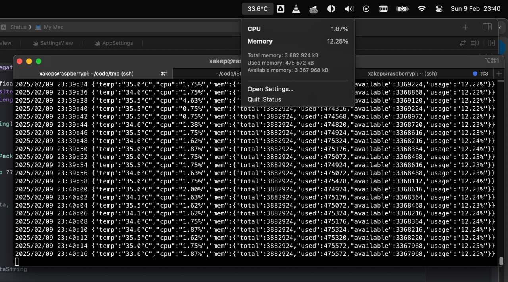

# iStatus
Shows the temperature, cpu and memory usage of the Raspberry Pi in the MacOS status bar



## How it works
The server parses files:
```
/proc/stat
/proc/meminfo
/sys/class/thermal/thermal_zone0/temp
```
generates JSON and sends it with a broadcast UDP request

## Manual install

### UDP Server
1. Build server
```sh
cd server
make build
```
2. Deploy to Raspberry Pi
```
scp istatus pi@raspberrypi.local:/home/pi/bin/
scp istatus.service pi@raspberrypi.local:/home/pi/bin/
```
3. Launch service on Raspberry Pi   
```sh
sudo -s
mv istatus.service /etc/systemd/system/
systemctl daemon-reload
systemctl enable istatus
systemctl start istatus
```
check
```sh
systemctl status istatus
journalctl -u myservice -f
```

### MacOS Application
I did the project over the weekend, I don't know how to make releases yet.  
¯\\_(ツ)_/¯